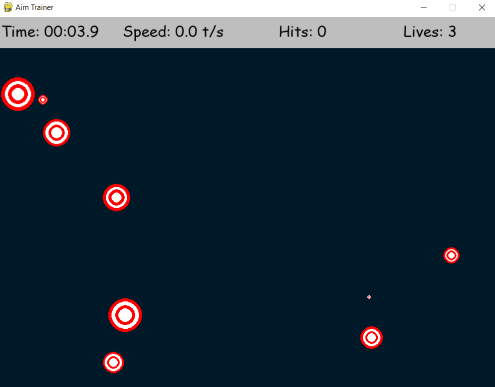

# Aim Trainer Game

Aim Trainer is a Python game designed to help players improve their aiming skills. The objective of the game is simple: the player must aim and shoot at targets that appear randomly on the screen.

## Technologies Used

- **Python** - The programming language used to develop the game.
- **Pygame** - A library used to create 2D games in Python, for graphics and event handling.

## How to Run the Project Locally

### Installation Steps

1. **Clone the repository:**

   ```bash
   git clone https://github.com/LuisSilva7/aim-trainer-game.git
   ```

2. **Navigate to the project directory:**

   ```bash
   cd aim-trainer-game
   ```

3. **Install project dependencies:**

   ```bash
   pip install pygame
   ```

4. **Start the game:**
   ```bash
   python main.py
   ```

## Screenshots

### Game


